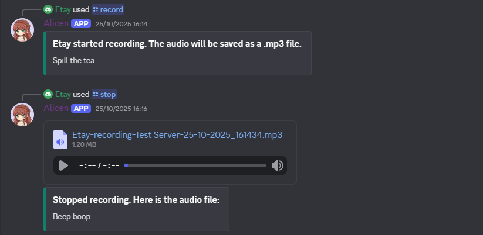

<h1>Discord Bot Recorder</h1>

A Discord bot that can record a voice channel and save the audio file as a mp3/wav/pcm file (mp3 by default).  
Implemented entirely in Python using [discord.py[voice]](https://discordpy.readthedocs.io/en/stable/) and [discord-ext-voice-recv](https://github.com/imayhaveborkedit/discord-ext-voice-recv) library, using modern slash commands and logging.

(Alicen as I-listen...)

<h2>Features</h2>

* Record the voice channel the bot is currently in by using 
`/record` command to start recording and `/stop` command to stop recording. Save the audio file in mp3 format (by defualt) and send it to the channel in chat if possible (limited to Discord's file size limit of 50MB).

**More features will be added soon!**

<h2>Requirements and Setup</h2>

* Here is a quick guide on how to [create a discord bot account](https://discordpy.readthedocs.io/en/stable/discord.html) and get the API token.

* [discord.py[voice]](https://github.com/Rapptz/discord.py) and [discord-ext-voice-recv](https://github.com/imayhaveborkedit/discord-ext-voice-recv) (both in requirements.txt).

* This bot is using [ffmpeg](https://www.ffmpeg.org/) to handle audio and [PyNaCl](https://pypi.org/project/PyNaCl/) (in requirements.txt) for voice support. Here is a short video on how to [download ffmpeg](https://www.youtube.com/watch?v=eRZRXpzZfM4) (not by me).

* Enable the Developer Mode in Discord by going to Discord's user setting/APP SETTINGS/Advanced.

* Create a `.env` file to store your bot's API token, your Discord ID (which you can get by clicking on your name in the bottom left corner and select Copy User ID) and the Discord server IDs of the location where you want the bot (right-click on the server icon on the left and select Copy Server ID, this is crucial so that the commands are synced to the servers immediately instead of waiting for Discord's automatic sync process to sync them, which can take a while). Save the token as `BOT_TOKEN`, your ID as `ADMIN_ID` and the servers IDs as `SERVER_#` (up to 10 server from 0-9, if you have more than 10 servers, you need to change it [here](servers_and_cogs.py) to make it work).  

After setting up everything and the bot is in the server, use `!sync` command to sync all the commands to the server immediately.  
(I am using the free version of [ElevenLabs](https://elevenlabs.io/), in the [command_audio](command_audio) file to produce an audio files for the bot, to announce that recording has started/stopped. All the required audio files are inculded in the repository for convenience, so you don't to use ElevenLabs for it to work).

  

Don't hesitate to contact me if you have any questions or feature suggestions.
